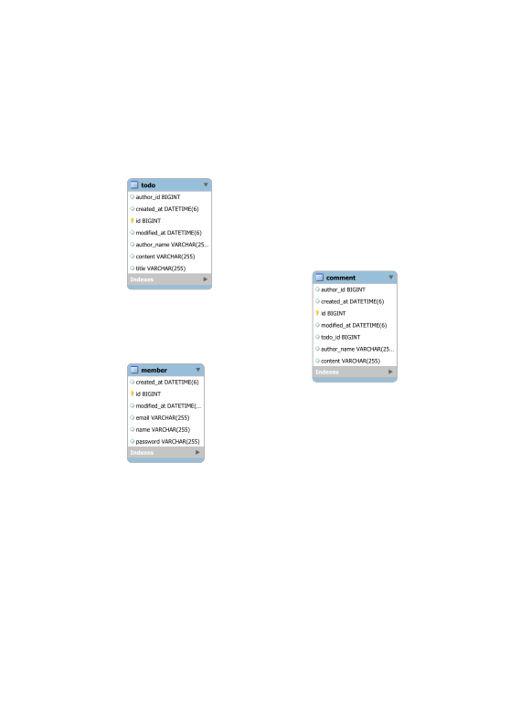

# 🚀 Spring Boot Todo V2 애플리케이션

> 💬 **"단순한 Todo 앱을 넘어, 견고한 백엔드 설계를 경험하다"**

이 프로젝트는 단순한 기능 구현을 넘어, **유지보수성과 확장성**을 고려한 소프트웨어 설계를 학습하고 적용하는 데 중점을 둔 Todo 애플리케이션입니다. 헥사고날 아키텍처(Hexagonal Architecture)와 객체지향의 핵심 원칙을 코드에 반영하고자 노력했습니다.

---

## 🎯 핵심 설계 원칙

이 프로젝트는 다음의 설계 원칙을 기반으로 구현되었습니다.

- **헥사고날 아키텍처 (Hexagonal Architecture)**
    - 코드를 `Domain`, `Application`, `Adapter` 계층으로 분리하고, **포트(Port)와 어댑터(Adapter)**를 통해 계층 간의 의존성을 관리합니다. 이를 통해 비즈니스 로직(Domain, Application)이 외부 기술(Web, Persistence)의 변화로부터 완벽히 보호되는 안정적인 구조를 구현했습니다.

- **도메인 모델과 영속성의 분리 (Domain-Persistence Separation)**
    - 도메인 모델(`Member`, `Todo`, `Comment`)이 **JPA 어노테이션(@Entity 등)에 의존하지 않는 순수한 객체(POJO)**로 설계되었습니다.
    - `Persistence Adapter`가 도메인 객체와 영속성 모델(`JPA Entity`) 간의 변환을 책임지며, 이를 통해 도메인은 특정 데이터베이스 기술로부터 완벽히 분리되어 비즈니스 로직에만 집중할 수 있습니다.

- **계층 간 책임 분리를 위한 수동 매핑 (Manual Mapping for Separation)**
    - 각 계층의 경계에서 데이터 변환을 담당하는 **전용 매퍼(Mapper) 또는 DTO**를 구현했습니다. 이를 통해 계층 간의 결합도를 낮추고, 각 계층이 자신의 책임에만 집중하도록 역할을 명확히 분리했습니다.

- **개방-폐쇄 원칙 (OCP, Open-Closed Principle)**
    - **QueryDSL**을 활용하여, 새로운 검색 또는 정렬 조건이 추가되더라도 `Application` 코드의 변경 없이 `Persistence Adapter`에서 유연하게 기능을 확장할 수 있는 구조를 구현했습니다.

- **타입 안정성 및 도메인 표현력 강화**
    - `NameVO`, `EmailVO`, `TodoTitleVO`, `ContentVO`와 같은 **값 객체(Value Object)**를 도입하여 단순한 원시 타입이 아닌, 비즈니스 의미를 가진 타입으로 데이터를 관리합니다. 이를 통해 컴파일 시점에 타입이 보장되고, 각 객체가 스스로의 유효성 검사 로직을 캡슐화하여 도메인의 응집도를 높였습니다.

## ✨ 주요 기능

- **회원 관리**
    - **JWT 기반 인증**: 안전한 사용자 인증 및 인가 처리를 구현합니다.
    - 회원가입, 로그인, 내 정보 수정, 회원 탈퇴 기능을 제공합니다.

- **할일(Todo) 관리**
    - **동적 검색 및 정렬**: **QueryDSL**을 사용하여 제목, 내용, 작성자 등 여러 조건으로 할일 목록을 동적으로 검색하고 정렬할 수 있습니다.
    - 할일 생성, 상세 조회, 목록 조회, 수정, 삭제 기능을 제공합니다.

- **댓글(Comment) 관리**
    - 할일에 대한 댓글 작성, 수정, 삭제 기능을 제공합니다.

## 🛠️ 적용 기술

| 구분 | 기술 | 버전 | 설명 |
|---|---|---|---|
| **Framework** | `Spring Boot` | 3.x | 안정적이고 빠른 애플리케이션 개발 환경 |
| **Language** | `Java` | 17 | LTS 버전의 Java |
| **Database** | `Spring Data JPA`, `MySQL`, `H2` | | ORM을 통한 객체지향적 데이터 관리 (테스트에는 H2 사용) |
| **Query** | `QueryDSL` | 5.0.0 | 타입-세이프(Type-Safe) 동적 쿼리 작성 |
| **Testing** | `JUnit 5`, `AssertJ`, `Mockito` | | 계층별 단위/통합 테스트를 통한 코드 신뢰성 및 설계 증명 |
| **Code-Gen** | `Lombok` | | 보일러플레이트 코드 자동 생성 및 제거 |
| **Security** | `jBCrypt`, `Java JWT (Auth0)` | | 안전한 비밀번호 해싱 및 JWT 기반 인증 |
| **Build Tool** | `Gradle` | | 유연하고 빠른 빌드 자동화 도구 |
| **API Docs** | `SpringDoc OpenAPI` | 2.x | API 명세 자동화 및 Swagger UI 제공 |

## 📁 프로젝트 구조

```
.
└── src
    └── main
        └── java
            └── indiv/abko/todo
                ├── global              # 🌍 전역 설정 (예외 처리, 보안, 공통 DTO 등)
                ├── member              # 🧑‍💻 회원 컨텍스트
                ├── todo                # 📝 할일 컨텍스트
                ├── comment             # 💬 댓글 컨텍스트
                └── tododetail          # 📄 할일 상세 컨텍스트 (조회용)
                     ├── adapter         # 🔌 Adapter: 외부 세계와의 인터페이스
                     │   ├── in
                     │   │   └── rest    #   - Inbound: 외부 요청을 애플리케이션에 전달 (Controller, DTO)
                     │   └── out         #   - Outbound: 애플리케이션의 요청을 외부로 전달 (DB 연동, 외부 서비스 호출)
                     ├── domain          # 🏛️ Domain: 핵심 비즈니스 규칙과 데이터
                     │   ├── in          #   - Inbound Port: 유스케이스 인터페이스 (UseCase, Command, DTO)
                     │   └── out         #   - Outbound Port: 외부 서비스 인터페이스 (Repository Port)
                     └── usecase         #   - Use Case: 실제 비즈니스 로직 구현체
```

## 💾 ERD (Entity-Relationship Diagram)



## 🚀 시작하기

1.  **저장소 복제**
    ```bash
    git clone https://github.com/VBKOROA/sprt-spring-todo.git
    ```
2.  **데이터베이스 설정**
    - `src/main/resources/init-db.sql` 을 관리자 계정으로 실행하세요.
3.  **애플리케이션 실행**
    ```bash
    ./gradlew bootRun --args='--spring.profiles.active=prod'
    ```
4.  **Swagger API 문서 확인**
    - 애플리케이션 실행 후, 웹 브라우저에서 `http://localhost:8080/swagger-ui/index.html` 로 접속하여 API 문서를 확인할 수 있습니다.
    - `docs/api_spec.md` 파일에서도 API 명세를 확인할 수 있습니다.
